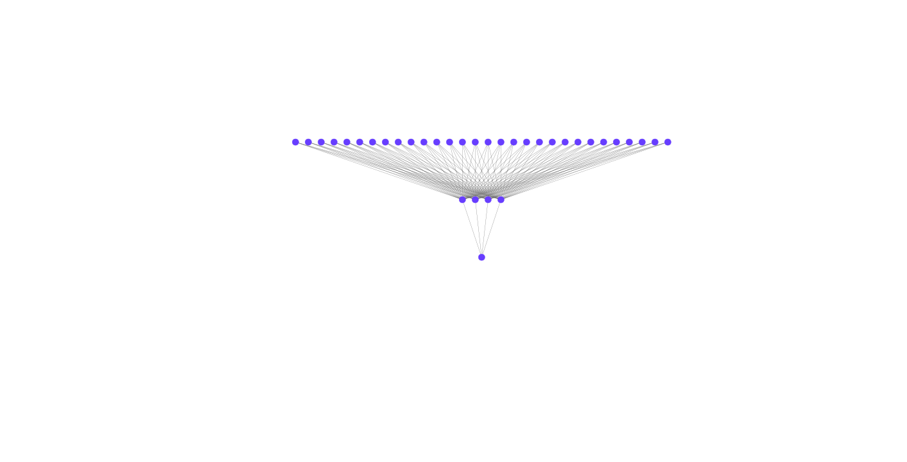

# MLP

Trabalho de multilayer perceptron da disciplina de inteligência computacional, CEFET-MG 2020.2.

## Execução

Para que o software execute, você precisa de instalar o numpy (única dependência):

```bash
pip install numpy
```

## Otimizações

1. Normalização: colocar os valores dos atributos entre 0.0 e 1.0.
2. Erro quadrático: usar o erro quadrático. Dessa forma, atualizamos mais os pesos que geram erros maiores e menos os que geram pesos menores.
3. Deslocamento do output em 0.05: como utilizamos a função sigmoid, deixar a saída em 1.0 e 0.0 é uma má estratégia. Isso se dá, devido ao fato de a sigmoid tender a 0.0 no menos infinito e tender a 1.0 no mais infinito, implicando na necessidade de treinamentos por muitas épocas para convergência.
4. Balanceamento: caso algumas das classes tiver uma quantidade de amostras menor que a outra, podemos balancear essa quantidade com um fator aleatório.
5. Taxa de aprendizado variável: usar uma taxa de aprendizado maior no início do treinamento, e ir decrescendo-a para evitar overshoot.

## Arquitetura

Abaixo, segue o diagrama da rede utilizada para resolver o problema da base de dados:

<p align='center'>
    
</p>
